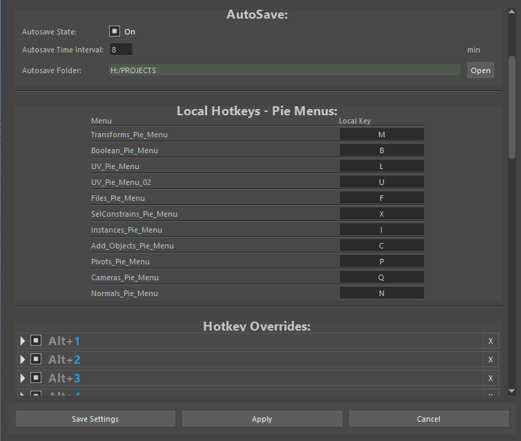

# Settings
<br>
<br><br>


In Settings you can edit the Control Panel navigation keys, its Pie Menu key bindings, the AutoSave status and properties, and the general hotkeys overrides.

# Sections:

## General Settings

1. `Control Panel RadialShelf`<br>
    This plugin has an option to display all of the shelves and their items in a circular fashion. The `Control Panel RadialShelf` button enables this feature. If enabled, the plugin will get the state of the shelves and their items on the next reload.<br>
    Pressing the 'space' key on the Control Panel will now toggle between the original window and the radial shelf.

2. `Save Current Shelf Buttons as Default`<br>
   This button will update the radial shelf with the current layout and buttons of the shelves. This will overwrite the previously saved shelves(of the radial shelf), and you don't need to save settings after this operation.

3. `Mesh Reloader export path`<br>
   This field sets the actual path where the `Mesh Reloader` will read and save temp file.<br>
   This is only relevant if the `Use New Reload Method` is unchecked.

## Control Panel: Navigation Keys

In this field you can set the local navigation hotkeys for the Control Panel.<br>
`Toggle_MainWindows` is the key that will toggle between the Control Panel primary windows and the radial shelf.
The rest of the fields signify on which hotkey can the internal circular shelf of the primary Control Panel be switched.

## AutoSave
Here are the settings for the StreamFlow autosave feature. You can turn the autosave on or off, set the interval, and the save location.

## Pie Menus
When hovering over the primary window of the Control Panel, pressing a key can be programed to call a pie menu. In this field, you can set the hotkeys for each pie menu that exists. The pie menus have their internal names displayed here. If you want to call a menu directly from maya hotkeys, you need to use the following syntax:<br>

```python
streamflow_fn_.module.RadialMenuWindow.call_pie_menu('Add_Objects_Pie_Menu')  # call create objects at selection pie menu
```
In the brackets you should put the internal name of the pie menu, which can be viewed in settings.


## Hotkey Overrides

In this section you can set and view advanced hotkeys, which can distinguish between tap and double tap, can be context sensitive - you can perform different operations with the same hotkey in the Outliner, UV Editor and Hypershade for example.

<br>

---

<span style="color: yellow;">Notes :</span>

* Only Hotkey Overrides will be updated right after Save. For everything else to take effect, the plugin needs to be `reloaded`.
* If you reopen the settings without reloading the plugin, it will load the old settings. However, if you close the window without saving, the settings will not be updated.
<br>
<br>


<a href="../../README.md#Settings">
    
</a>