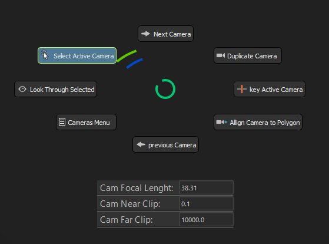
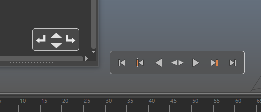
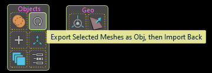
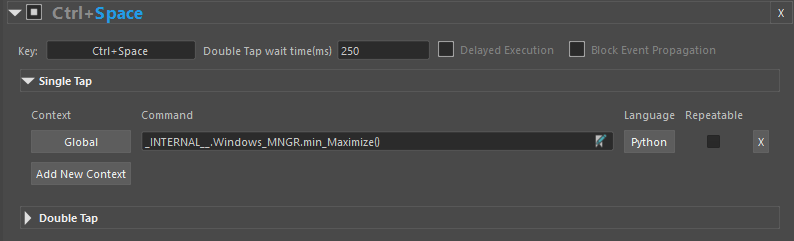

# StreamFlow - Plugin for Autodesk Maya
Python plug-in for Autodesk Maya.

 

# Table of contents:
* [Installation Guide](#Installation-guide)
* [User Guide](#user-guide)
  * [Main Control Panel](#the-control-panel)
  * [Extra Popups]()
  * [Circular Shelf](#circular-shelf)
  * [Pie Menu](#pie-menus)
  * [Settings](#settings)
  * [Hotkeys](#hotkeys)
  * [Extra Commands](#extra-commands)
# About
This plugin is intended for improving workflow efficiency in Autodesk Maya.\
Big part of it is the UI, but there are also numerous scripts contained within that create new, or extend existing tools.\
It is predominantly oriented towards modelling, but not limited to it.

Tested Maya versions:

| Maya version   |      UI      |  All functionalities |
|----------|:-------------:|------:|
| 2017    |   working     |   not fully tested |
| 2018    |   working     |   Yes |
| 2019    |   working     |   Yes |
| 2020    |   working     |   mostly tested |
| 2022    |   working     |    not fully tested  |
| 2023    |   unknown     |    unknown |

Supported Operating Systems:
  * Windows

### Features:
* [Main Control Panel](#the-control-panel)
* [Circular Shelf](#circular-shelf)
* [Autosave Option](#autosave)
* [Extensive Pie Menus](#pie-menus)
* [Extensive Hotkey Overrides Option](#hotkeys)
* [New Tools](#peculiar-pie-menus)
* [Reporting bugs and asking questions](#reporting-bugs-and-asking-questions)
* [Terms and Conditions](#terms-and-conditions)

 

# Installation Guide
## Windows 
  * <b>Automatic</b>
      1. Extract Contents from the zip folder at some location
   
      2. In the extracted folder,there is a subfolder `INSTALLER_PLAIN`. Run the `installer_plain.exe` from there. It will open a python shell asking for a version you would like the install the plugin to.
  
  * <b>Manual</b>
    1. Extract Contents from the zip folder at some location.
    2. Copy  and edit a file:
       1. From the extracted files, grab `MMGA.py` and place it in the folder:   `\Users\<USER>\Documents\maya\<MayaVersion>\prefs\scripts`
       2. Open "MMGA.py" with a text editor and find the text `def streamflow_fn_(toolPath='Z:/Projects/Maya_Dev/MMGA'):` - should be at line 46
       3. Replace `Z:/Projects/Maya_Dev/MMGA` with the directory path of the extracted content's folder.
  
   
    1. Edit "userSetup.py"
       1. From the extracted files, open the file "Starter.txt" and copy the text.
       2. Open the file `userSetup.py` from: `\Users\<USER>\Documents\maya\<MayaVersion>\prefs\scripts` 
       3. Paste the content at the end the existing text inside the `userSetup.py`, if there is existing text. If not, just paste.

    * Notes :

        `<MayaVersion>` is the version you want to install the plugin to. Can be 2017, 2018, 2019, 2020, 2022.  
        `userSetup.py` might not be present inside this folder. If so, create a nex txt folder, and rename it to `userSetup`, and change the extension `.txt` with `.py`

Important: When installed, Maya will continue to use the files directly from where they were extracted. Extract to a meaningful location and do not delete afterwards.
  

## Reload Guide
### Windows
  
   To reload the whole plugin in session, the following python command needs to be executed: 
                
      streamflow_fn_()
  
  To hard reload, one or two files should be deleted from the prefs:

  Even when reinstalled, the plugin will not create default settings if they are already present in the appropriate folder. 

  When initiated, the plugin copies its default setting into this folder: `\Users\<USER>\Documents\maya\<MayaVersion>\prefs\MMGA`.

  The files are called `HotkeysData.json` and `SK_Wnd_GeneralSettings.json`. The first one holds only the custom hotkey data.  

  When either of these files are deleted, the plugin will create new defaults on startup or on reload.

## UnInstallation Guide
#### Windows
  1. Open the file `userSetup.py` from:  `\Users\<USER>\Documents\maya\<MayaVersion>\prefs\scripts`
  2. From this file, Remove the following lines:

          """MMGA IMPORT"""
          import os
          import maya
          import MMGA

          with open(os.path.splitext(MMGA.__file__)[0] + ".py") as fh:
              exec (fh.read())

          maya.cmds.evalDeferred("streamflow_fn_()",lp=1)
          """MMGA IMPORT"""
      Or if no foreign scripts are loaded through this file, delete it completely. 
      This will stop the plugin from being loaded on startup.

      Additional Files and folders to delete:
      1. `MMGA.py `from:  `\Users\<USER>\Documents\maya\<MayaVersion>\prefs\scripts\`
      2. `MMGA` folder, from: `\Users\<USER>\Documents\maya\<MayaVersion>\prefs\`
  

# User Guide
## The Control Panel

  

>The Control Panel is a floating window that has various plain and interactive buttons, and contains references to all of the pre-build Pie Menus.

>By default, a hotkey override will be installed on the key "S", which will call and hide this window. It can be changed to whatever suits the user in [Settings]().

>To its center is a disk on which various buttons are layed, hereinafter referred to as The Disk. The Disk is composed of two layers, by default accessed by the keys "A" an "D", which can also be changed in the settings menu. 

>To the center of The Disk, there is a small red button. This button holds the two Pie Menus mapped to right and left mouse click, and two others activated with modifiers+mouse click

>The small red button also responds to Wheel Up and Down. This action [Snaps the Camera](#snap-camera) to the closest ViewPlane, and toggles the orthographic view. More below.

>The disc autofocuses buttons that are placed on it, based on the current mouse position. When focused, every button immediately pops up a tooltip with further description.

>The first layer contains most of Maya Editors.\
>A click will toggle an editor, while Wheel Up and Down will turn on-off the selected editor.
> * Note :
> 
>   * The top most button toggles the Render view, while Right Mouse Click will spawn a Pie Menu that let's you set the desired render engine.\
>      If selected render is Arnold or Redshift, it will call their built-in renderers, for all else, Maya default Render View will be called. 
> 
>    * Editors that are shut down this way are not destroyed, just hidden. Most of them require extra second or two, or 15 to turn on when destroyed. 
>      If some editor is turned off in this manner, the default Maya button might not turn it on, because it is just hidden. 
>      Maya only checks if an editor exists or not before turning it on. Keep this in mind.

>The second layer contains most of the Pie Menus that are scattered in boxes around the Disc. They are just shortcuts of all Pie menus contained in the Boxes around the Disc.
> * Note : Clicking a Pie Menu Shortcut button indirectly will work only on Windows OS.

>In [Settings](#settings), a [Circular Shelf](#circular-shelf) can be enabled. 
When enabled, the hotkey "Space" will toggle between the Control Panel and the Circular Shelf.

> Most of the pie menus can be called with keystroke from this menu. The keys can also be changed in [Settings](#settings). 

## <b>Peculiar Box Menus:</b>
* ### <b>AutoSave</b>:
  Autosave is created out of frustrations with the default Maya Autosave. It addresses most of the issues the default one has. 
  It will not clog up disk space so quickly, nor will it spawn  application blocking popup to ask for permission to save. 
    <b>Features:</b>
  * When performing autosave, it will deactivate itself if Maya application is not active. It will automatically activate when Maya application is activated.
  * If Maya application is active, but idle, or no change is made to the scene, it will skip autosave.
  * Tries to save as Maya Ascii. If unable to do so, will save as Maya Binary.
  * Prompts a non-interrupt popup to the central part of the viewport, notifying that Autosave action is imminent, with the option to cancel it.
  * Self resets when New Scene is created, or old one Saved.
  * If active, it is present in the top part of the Control Panel. The button on the left will call a Pie Menu, where AutoSave can be Paused, Reset, forced to perform autosave at that moment, 
  and can open the location of the autosave folder in file explorer. 
   

  <b>Unexpected Feature:</b>
  * If Maya is stuck in a deep calculation, but not crash frozen, AutoSave is sometimes still able to perform the action and save the day.
          

  Note : 
  AutoSave has a dedicated section in Settings. There its interval, path, and status can be set. Turning it off will result with its removal from the Control Panel.  
  
* ### <b> InfoBox: The unnamed box below Autosave:</b>
  This box contains interactive buttons that can be clicked or wheeled, signifying by order : 

  1. Transform Constrains 
  2. Soft Selection volumetric or surface falloff
  3. Global Wireframe status
  4. Transform space for Move, Rotate and Scale tools
  5. Selection Constrains
          
  * Note : 
        Selection Constrains button has also a Pie Menu attached to it, and Right Click will turn off any Constrain active. 
        There is also a copy of it in the right tab of The Disc, because why not.     
 

## Extra Popups

  

>This are Popups that will show instead of the Control Panel, when mouse is hovering over the Outliner or the TimeSlider.

>They will disappear once the mouse leaves their area, but can be pinned by double pressing 'Alt'

> They can be moved anywhere on the screen with the mouse while 'Alt' is being pressed.

>The Outliner widget contains actions that will, by order: 
> * Degroup the current item. This will place it right after the former group.
> * Move item up or down the Outliner. Mapped to central button's Mouse Wheel.
> * Group in the current item with first group positioned below it.

> The TimeSlider widget contains all of the actions of the built in Maya widget, and has few hotkeys mapped to it, These hotkeys are available only when the cursor hovers over the widget:
> * Ctrl+X, Ctrl+C, Ctrl+V - cut, copy, paste keyframe.
> * Space or Shift+Space: Play animation forward or backward.
> * A or D: Move one key backward or forward.
> * Shift+A or Shift+D : Set the current frame to min or max of the available frames.
> * K: Set keyframe

 

## Circular Shelf

  

This Window holds copies of all of the buttons present in the Maya Shelves. It can be enabled in [Settings](#settings). 
The first time the plugin is called with the Circular Shelf enabled, it will get the state of the shelf buttons and write it to disk. Every next time it will read from the disk. 
The shelves have click and double click. Double click is replaced by right click. 
In the middle of the window there is a red button that pops up a Pie Menu with which you can navigate between the radial shelves. 
The shelves can also be navigated trough by the default hotkeys "A" and "D" - the same that controls The Disc in the primary Window. 
It is show to the screen by demand, and contains all of the buttons the original Maya Shelf has. The Maya Shelf can be turned off to conserve screen space. 
It is easily navigable, once used to it. 
The shelfButtons don't update automatically with changes in the shelves. To update changes, click the `Save Current Shelf Buttons as Default` button in `Settings`. It will save the shelfButtons as default buttons for future use. 

Known issues: 
  *  Takes some time to load, adds 2-3 seconds of load and reload time to the plugin.
  *  Can cause an error at Maya startup, trying to read all of the shelf data. This will result in the plugin not loading, and can be resolved by calling the [reload command](#reload-guide). 
    Because of this danger, it is disabled by default. If you enable the shelf in `settings`, and `reload` the plugin afterwards, It will write the shelf data to a file, and this will no longer be an issue.
  
---
## Pie Menus

  

The Pie Menu is a inspired by Maya's marking menu and Blender's pie menu, although it has features different from both of them.

Pie Menu buttons can have a sibling right next to them, an optionBox, or a submenu that pops up when button is focused.

The buttons are autofocused, the cursor doesn't need to hover over them in order to execute its command.

The menu can be called with mouse click, or from keyboard.

If the key is released without moving the cursor, the menu will stay visible.

If the cursor is moved from the point of origin to the circle boundary, the menu will close without executing a command.

The menu can have two shells, inner and outer, and an extra box to the bottom.

### <b>How buttons autofocus works:</b>

>There is an invisible circular boundary around the center of the menu. If no modifier is pressed, and the cursor has crossed the boundary, the outer shell will come into focus.
>Alternatively, if the cursor is inside the boundary, and Alt Modifier is pressed, the outer shell will come into focus.

>If Shift Modifier is being pressed, the menu will focus only on the button to the right of the primary one - a sibling or an optionBox.\
>Shift Modifier press takes into consideration if Alt Modifier is also pressed, or if the shell boundary is crossed.

>Menus can have empty spaces instead of buttons. If a space is encountered, the menu will autofocus on the nearest button on the virtual circle.

>The menu itself is an invisible window. When getting enough far away from the origin point, It will disengage its autofocus.\
>When activated with mouse click, and if the click is not released after activation, it will continue to autofocus even after leaving the window's borders.

 

--- 
## Peculiar Pie Menus:

###  <b>1. Pie Menu -Central Menu Right Click</b>
  
  >This Menu is accessible only trough the Control Panel, with Right Click on the red button at the center. 

  >Most of the tools within work with multi mesh selection. 
  
  > Note :  
  > * All of the tools created in Python or Mel, and are performing slower then the built in Maya tools. 
  >  For Meshes with high polyCount, it will perform noticeably slower - for example, extract selection will take 7-8 seconds for a mesh of 160 000 polygons, vs 1-1.5 seconds for a regular Extract. 
  > Merge Objects will not be so highly affected.  
  These are some of the tools that need introduction:

  * Tools Duplicate, Merge, Extract:  
    

    ><b>Duplicate:</b> Creates a Duplicate of Meshes, or selected components. Note: components must not be faces.

    ><b>Chip Off:</b> Duplicates selected Meshes, or components, but keeps them inside the mesh.

    ><b>Merge: </b> Combines Multiple Meshes and parents them to the transform of the last selected Mesh. This transform remains intact, and any connections it may have are preserved.

    ><b>Extract Selection - Split Mesh: </b> This is a context button. 
    >  * In <b>Object Mode: </b>Performs  a regular split mesh.
    >  * In <b>Component Mode: </b>it will split the selection into a new Mesh. add a tail "_Pt_01" to its name, and place it below the original mesh. 

     

    >Note :   
    > * <b>Merge</b> function sometimes locks the Mesh normals. Perform Unlock Normals in Mesh Display menu to fix this.
                
 

  * Tool-Smart Connect:  
    Smart Connect is context sensitive. It does different things for Face, Edge, and Vertex selection:
    * Connect Faces:   
        
        In Face Mode, SmartConnect performs connect components, and selects one random half of the original faces.

         
      

      
    * Connect Edges:   
        
      In Edge Mode, SmartConnect does different things, in different circumstances:
       * If one Edge is selected, it bridges the two neighboring Edges that lie on the Mesh Border, and selects the newly created one
       * If two neighboring Edges are selected, It performs polyAppend on the two Edges.
       * If two edges are selected, and they are not neighbors, it performs a simple bridge.
       * If more then two are selected, performs bridge on all of them.
    
      

    * Connect Vertex:   
      
    Same as with Edge Mode, does different things depending on the selection:
      > If one Vertex is selected, and no other is Highlighted, it will perform PolyCloseBorder if that Vertex is on the Border
      
      > If two Vertex are selected, or one Vertex and another is Highlighted:

      > If Vertex are neighbors: polyConnectComponents.

      > If they are not neighbors: MultiCut.

      > If both Vertex are on Border: Fill hole, then polyConnectComponents, or MultiCut.

      > If more then two Vertex are selected:
        > * If the Verts are on the same face, it will connect every Vertex with the last one.
        > * If they are not neighbors, it will connect every Vertex with the Next one in Selection. 

       

      >Notes :
      > * When connecting two Vertex, and they both lay on a Border and are not neighbors, the tool will always perform PolyCloseBorder before connecting. You may not want that.
      > * When connecting Vertex that are not neighbors, the tool performs MultiCut between them:
      >    * It is not accurate, as that is the intrinsic property of the MultiCut Tool. 
      >    * When using the Tool in this fashion, make sure that you are close enough in the viewport and all of the Vertex are visible on the screen. Use it like you would use the MultiCut Tool.  
      >
      >
      >     * Currently, this part of the Tool works only on Windows OS.

         
  
    ---
  * Tools-InsertEdgeLoop++ and Add Divisions++:   
      
    Both of these buttons work in similar fashion. Wheel Up or Down will change the number of subdivisions. Click applies the set divisions. 
    Add Divisions Button is context sensitive:
    * In Edge Mode, it will add subdivisions to the selected Edges.
    * In all other modes, it will perform polySubdivideFacet according to the multiplier displayed on the button.

     

    ---
* Tool-Edit multiple Edge Loops:   
      
    This tool edits multiple edge loops, without jumbling the topology.
    Can be performed with button click, but also with Wheel Up. Wheel down just performs undo on the action, stopping when undo queue reaches some other command.

    Note : Wheel down,  the undo, can sometimes misbehave and not perform the action. Most likely to happen when in Isolate Selection mode.

     

    ---
* Tool-Equalize edge loops:   
      

     

    ---
* Tools-Straighten Edge Loops, straighten Vertex:   
      
This button straightens selected Edge loops. When it will find the end points for each edge, and scale down from there.  
The button to the right straightens vertices. It will straighten everything according to the first and the last vertex.  
Note : Works with transform constrains enabled - Edge and Surface Constraints.
     

    ---
###  <b>2. Pie Menu - Create Primitives At Selection</b>
 
  
 
 

---

## Peculiar Tools:

### Snap Camera
 
  

Snap Camera is available in [Shortcuts](), and on The Disk.
When activating it from The Disc, it will perform the toggle, and spawn a duplicate of the button from The Disk right under the mouse. 
When making a camera ortho, it will maintain its position and have the same view as before, not obscured by any object behind its back. 

This button will self-hide when the cursor leaves its area, and has slightly different commands:
  * It takes two wheel strokes to get to do the toggle.
  * The intermittent stroke snaps the camera to the nearest View Plane, but does not make it orthographic. This is useful when the active camera needs to be cleared of rotation transforms.
 
 

---

### Reload Mesh
 
  

With heavy modeling in Maya comes the bugs. No matter what you do, Maya just can't get rid of some internal trash during mesh creation. 
As the description says, this will export Meshes to disk, reimport, and replace the old mesh with the new one, preserving it's name and position in Outliner. 
Exporting and reimporting mesh as .obj fixes many of the persistent problems, such as maya falsely detecting non-manifold uv or geometry, tools not responding to mesh etc. 
When performed on complex scenes, the resulting scene file size has been reduced sometimes by a third(150MB to  100MB). This is the amount of unneeded and sometimes obtrusive data Maya keeps.

Note : 
* What it does in the background is export every mesh as .obj and reimport back, one by one. This can be damaging to the SSD in the long run, if done in large numbers (modern SSDs have 3,000 to 100, 000 write cycles per memory block). 
That is the reason why it has customizable import-export link, found in the Settings, named "Mesh Reloader".

* Doing this to a mesh will set its normals to soft, will not preserve color sets, extra uv sets, keyframes, only raw mesh data with uv and it's material.
 
 

# Settings

  

in Settings you can edit the MainUI navigation keys, its Pie Menu key bindings, the AutoSave status and properties, and the general hotkeys overrides.
Most of the items here are self-explanatory. 

Note : Only Hotkey Overrides will be updated right after Save. For everything else to take effect, the plugin needs to be `reloaded`.

  

## Hotkeys
 
  

The Hotkeys are meant to be used as a supplement to the Maya's native hotkeys. They can do what the native hotkeys can't, and vice versa.

Features:
> * Context Sensitive 
>   There are currently twelve contexts available, such as "UVEditor", "HyperShade", "MainViewport", "TimeSlider", etc. 
> Multiple contexts can be set to a single key. 

> * Every command can be set to be repeatable - If true, the command will be added to the Maya's repeatLast list after execution.

> * Will not override the native hotkeys.

> * Can recognize Double Tap.

Explanation: 
Maya's default hotkeys are still valid. When context or a single click are not mapped, the KeyEvent can be sent to Maya for it to be processed there.

* Delayed Execution:  
    * Checked:  It will execute the Single Tap command, or send the KeyEvent to Maya if single tap is not set, only when the time waiting for Double Tap is expired and no tap is registered. 
    This means that the Single Tap command will always have a delay in execution, since it will wait for the said amount of time to pass before executing the command.
    * Unchecked: It will execute the Single Tap command immediately, and wait for a possible Double Tap to occur.  

    This feature is  used to avoid the Single Tap command to be executed, when the intended action is double tap. 
    This setting will also affect the underlying Maya hotkey execution.

* Double Tap wait time:  
  How many millisecond should the Hotkey wait before sending the event to maya.

* Block Event Propagation:  
  Will mute the underlying Maya hotkey,  even when no command for the context is found.

Notes :
  * If a command is set to the "Global" context, all other contexts in the field are ignored. 
  * In the package, in the `DoubleTap` subfolder, there is a zip file called `Basic_Key_Data-extensive.zip`. 
    This file contains more then 30 defined hotkeys for various contexts. To use it, you need to: 
    * Delete\Rename the old file called `Basic_Key_Data.py`
    * Unzip the file `Basic_Key_Data-extensive.zip` in the same folder, and make sure it has the same name as the removed file above.
    * Delete the stored user hotkeys file `HotkeysData.json` from: `\Users\<USER>\Documents\maya\<MayaVersion>\prefs\MMGA`
    * Run Maya. Now the plugin will read the hotkeys from the new file, and write it to it's program data.
  

# Extra Commands

### This project started as a series of short scripts for hotkeys. Some functions are still best used like that. Here is a list of most of them:  

    streamflow_fn_.module.P_SlideEdge_Absolute() #Python  
    streamflow_fn_.module.P_SlideEdge_Relative() #Python
    
  > These two functions activate the Maya's slide edge tool, with relative or absolute mode enabled.
---
    wireFrameOnShaded()   #MEL

  > Toggles WireFrame on shaded 
---
    WireFrameGlobal_TGL()  #MEL

  > Toggle Wireframe on selected
---
    Detach_Cut_UV()  #MEL

  > Detaches Geometry by Edge in viewport, Detaches UV in uv editor
---
    custom_deleteHistory()  #MEL

  > Deletes history of selection, even if selected mesh is in component mode, or just hilighted. 
  >Works with multiple Objects selected.

---
    AddLatticeToObject()  #MEL

  >Adds a Lattice to the selection - Mesh or Components, and sets the context to Lattice Point edit. 
  >The Lattice is invisible in the Outliner, has 2x2x2 divisions. 
  >This is intended for a Mesh hot fix, where you need to do a tweak and delete the history.
---
    ConvertToObject()   #MEL
    ConvertToVertex()   #MEL
    ConvertToEdge()     #MEL
    ConvertToFaces()    #MEL
  >Converts selection to Object Mode or some component mode. Safe and free of misclicks. 
  >ConvertToVertex will go into "lattice point" or "curve point" mode
 if that's what is selected.
---
    RotateStuff("X")  #MEL
    RotateStuff("Y")  #MEL
    RotateStuff("Z")  #MEL

  >Rotates mesh by its pivot on a given axis.
  >Rotates component selection taking the manipulator position as the center. 
  >RotateStuff("X") and RotateStuff("Y") will rotate the UV clockwise or counterclockwise when in UV Edtitor. 
  >Rotate angle is 45 degrees.
---    
    flipMesh_or_UV("X")  #MEL
    flipMesh_or_UV("Y")  #MEL
    flipMesh_or_UV("Z")  #MEL

  >Same as RotateStuff() above, but flip the Mesh or UV for the given axis. 

---

---
    streamflow_fn_.module.CursorOrientation.Toggle()  #Python

  >Toggles The cursor orientation on Move, Rotate and Scale tools to: World, Object, Component modes.
---
    streamflow_fn_.module.Windows_MNGR.toggle_Editors()  #Python

  >Toggles AttributeEditor or ChannelBox. 
  >If those are detached, places each to the right in the viewport, and rescales the window's heigh to fit the Viewport.
---
    streamflow_fn_.module.Windows_MNGR.toggleOutliner()  #Python

  > Toggles the Outliner. 
    If the Outliner is detached, it places it to the left in the Viewport and rescales the window's heigh to fit the Viewport. 
  > This action is aware if PolyCount is turned on or off, and rescales the Outliner appropriately.
  
---
     streamflow_fn_.module.isolate_things()  #Python

  > Isolates Selection in Viewport or UV selection in the UV Editor,
    Makes selected node solo in Hypershade.
---
    streamflow_fn_.module.toggle_ortho()  #Python

  > Makes the current camera ortho and snapped to the nearest plane, or the opposite. 

---
    streamflow_fn_.module.Windows_MNGR.min_Maximize()  #Python

  > Minimizes or Maximizes any floating window of Maya.
  > If performed when mouse over the Viewport, toggles FullScreen mode.
---
    streamflow_fn_.module.toggle_Default_Mat()  #Python

  > Toggles the displaying of the  default material (lambert) on the active panel.
---
    TGL_Objects_Materials()  #MEL

  > Toggles the selection between objects, and their materials.

 

# Reporting bugs and asking questions

## Bugs and questions are handled in [Issues](https://github.com/ScriptorBob/stream-flow/issues). 

### Q: How can I report a bug?

1. Go through the [reported bugs](https://github.com/ScriptorBob/stream-flow/labels/bug) and make sure this bug hasn't already been reported.
2. If you are unable to find the specific bug there, then [report](https://github.com/ScriptorBob/stream-flow/issues/new?labels=bug&template=bug) a new one.
3. If you are new to GitHub issues, make sure you go through [issues quickstart](https://docs.github.com/en/issues/tracking-your-work-with-issues/quickstart) first before opening a new issue.   
4. Add the steps to reproduce the problem and provide as much details as possible.

### Q: How can I ask a question?

1. Go through the [existing questions](https://github.com/ScriptorBob/stream-flow/labels/question) and make sure this question hasn't already been asked.
2. If you are unable to find the specific question there, then [ask](https://github.com/ScriptorBob/stream-flow/issues/new?labels=question&template=question) a new one.  
3. If you are new to GitHub issues, make sure you go through [issues quickstart](https://docs.github.com/en/issues/tracking-your-work-with-issues/quickstart) first before opening a new issue.
4. Provide as much details as possible.
 
 

 

# Terms and Conditions

By using this software you agree to the following [Terms and Conditions](
https://htmlpreview.github.io/?https://github.com/ScriptorBob/stream-flow/blob/main/TOS.html)
