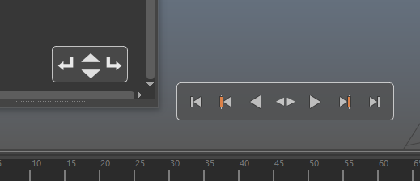

# Extra Popups
 
  

These popups will be shown instead of the Control Panel when the command is called and the mouse is hovering over the Outliner or the TimeSlider.

They will disappear once the mouse leaves their area, but can be pinned by double pressing 'Alt'

They can be moved anywhere on the screen with the mouse while 'Alt' is being pressed.

The Outliner widget contains actions that will, by order: 
 * Degroup the current item. This will place it right after the former group.
 * Move item up or down the Outliner. Mapped to central button's Mouse Wheel.
 * Group in the current item with first group positioned below it.

 The TimeSlider widget contains all of the actions of the built in Maya widget, and has few hotkeys mapped to it, These hotkeys are available only when the cursor hovers over the widget:
 * Ctrl+X, Ctrl+C, Ctrl+V - cut, copy, paste keyframe.
 * Space or Shift+Space: Play animation forward or backward.
 * A or D: Move one key backward or forward.
 * Shift+A or Shift+D : Set the current frame to min or max of the available frames.
 * K: Set keyframe

 
 

