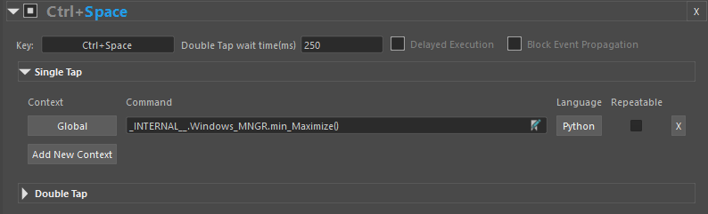

# StreamFlow Hotkeys
 
  

The hotkeys can be created and edited in the [StreamFlow settings window](../UIs/./settings.md#).
They have several advantages over the default Maya hotkey implementation, and it is possible to flawlessly use them in different versions of Maya.

Features:
* Can detect double tap.
  
* Context Sensitive: 
  There are currently twelve contexts available, such as "UVEditor", "HyperShade", "MainViewport", "TimeSlider", etc. 
  One key can be perform different tasks in different panels, if set so. 

* Every command can be set to be repeatable - If true, the command will be added to the Maya's repeatLast list after execution.

* Works with Maya's native hotkeys.
  Maya's default hotkeys will still work. A key can be set to respond to double tap, and if single tap is detected, it would sent the key event to Maya.

* Delayed Execution:  
    * Checked:  It will execute the Single Tap command, or send the KeyEvent to Maya if single tap is not set, only when the time waiting for Double Tap is expired and no tap is registered. 
    This means that the Single Tap command will always have a delay in execution, since it will wait for the said amount of time to pass before executing the command.
    * Unchecked: It will execute the Single Tap command immediately, and wait for a possible Double Tap to occur.  

    This feature is  used to avoid the Single Tap command to be executed, when the intended action is double tap. 
    This setting will also affect the underlying Maya hotkey execution time.

* Double Tap wait time:  
  How many millisecond should the Hotkey wait before sending the no-double-click event.

* Block Event Propagation:  
  Will mute the underlying Maya hotkey,  even when no command for the context is found.

Notes :
  * If a command is set to the "Global" context, all other contexts in the field are ignored. 
  * In the package, in the `_extras` subfolder, there is a file called `HotkeysData.json`. 
    This file contains more then 30 defined hotkeys for various contexts. To use it, you need to: 
    * Replace the default `HotkeysData.json` located at `\Users\<USER>\Documents\maya\<MayaVersion>\prefs\MMGA`  with the one from the `_extras` folder.
    * Run Maya. Now the plugin will load the advanced hotkeys.
  * These hotkeys can interfere with the script editor's popup widget, and with the dropdown menus found in the Attribute editor for example. Instead of focusing on the letter pressed in the dropdown, they will execute the command set for the said window. This is a bug that will be fixed in later version.

 
 

