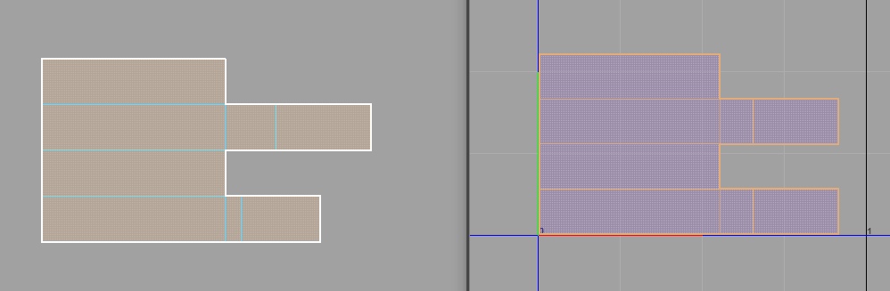

# Rectangulate UV
<br>


Python Command:
```python
streamflow_fn_.module.RectangulateUV.unfold_multiple(cmds.ls(sl=1,fl=1)) 
```
---


This tool is substantially slow and quirky. Read the details before using it.<br>
In the background, it saves the current uv connections, unitizes every polygon, and stitches them back, finally averaging the x and y edge lengths. <br>

* The tool will operate on uv shells that are connected to the current selection.
* It will give the correct result only if all of the quads in the shell are arranged in grid-like pattern.
* The mesh in question should have pure cube topology.
* The UV should be unfolded before using this function. This is needed because the tool needs good average edge lengths in its calculations.
* There is a workaround if the mesh contains non grid-like topology, but it requires the mesh to have a proper cube topology around the uv borders. This means that every parallel line must contain the same amount of edges.<br>
  As demonstrated in the example below, you need to separate the outline of the UV border in question, rectangulate that piece, and stitch the mesh together while the rectangulated part is frozen. Unfreeze the frozen pieces next, select only the inner topology and average the UVs with Maya's `Optimize` tool.<br>
<br><br>

* If you have multiple appendages on one side, although they are not connected, the tool will average them together. You will need manual tweaking in order to unfold the UV properly.
<br><br>


<br>
<br>


<a href="../../v_01_01_00_README.md#rectangulate-uv">
    
</a>