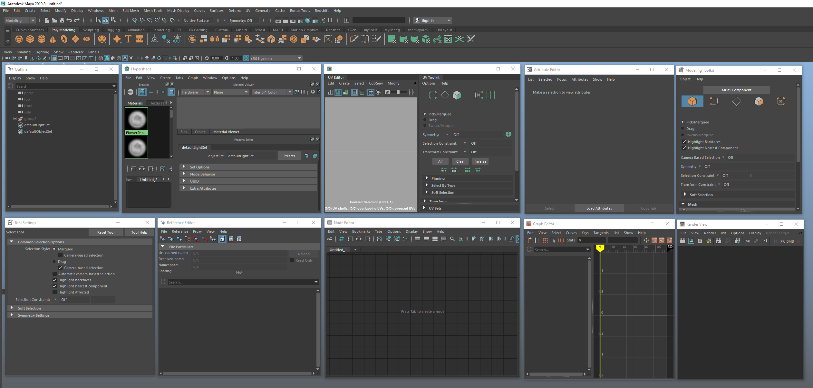

<!-- omit from toc -->
# Floating Window icons

  

This is more of an aesthetic feature, where most of the floating windows will automatically get their appropriate icon. When minimized, the window will still have its icon, which will allow you to better find the window you need.

 
 

