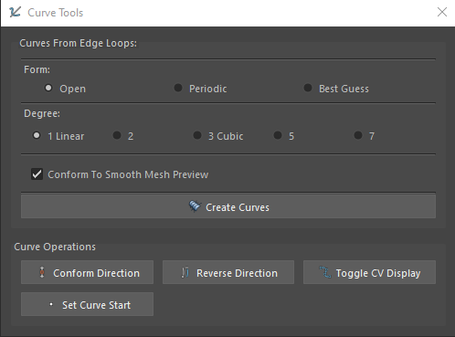

# Curve Tools




<br>

This tool is designed primarily to ease the process of creating guide curves for hair systems.<br>

## Description 
The first section allows you to create multiple curves from the currently selected edge loops. There is easy for the created curves to have the correct orientation at this stage, but there is a tool for that in the second section.

The second section contains some useful tools:
1. Conform Direction:<br>
  Every opened curve has a starting and an ending point. This operation takes the world position of the last object and sets the starting points of every curve in the selection to be the one closest to the last object - it reverses the curves that have their end points closer. If only curves are selected, it will do the same, but will orient the curves to the first cv of the last selected curve.

2. Set Curve Start:<br>
   This operation will set the currently selected cv as the starting point of the parent curve. Currently only works on single curve in the selection.

## Access

Python Command:
```python
streamflow_fn_.module.CurveTools()
```
Can also be found in the Control panel, in the `Extras+Settings` section.
    
---

<br>


<a href="../../v_01_01_00_README.md#curve-tools">
    
</a>