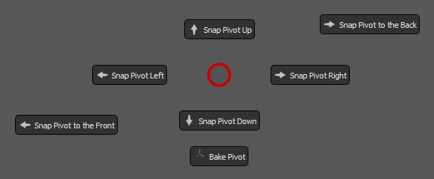

# `Adjust Pivot` Pie Menu

<br><br>

Python Command:
```python
streamflow_fn_.module.RadialMenuWindow.call_pie_menu('Pivots_Pie_Menu')
```

It can be called by double tapping the "V" hotkey directly in Maya. This shortcut can be altered in the plugin settings.


This menu allows you to quickly set the pivot of the selection to one of its world bounding box extremes.<br>
The pivot is being set from the current active camera, and the tool discerns the appropriate extreme that the pivot should be set to.

It works in object mode, as well as in component mode.

## Object Mode
In object mode, the tool will adjust the pivot to the appropriate extreme for every object in the selection. In this version, having parent nodes that are not frozen will result with inaccurate pivot placement, and this is worked upon.

## Component Mode
In component mode, the tool adjusts the position of the temporary manipulator of the current selection. The bounding box of the selection is always calculated in world space, and it works accurately even if the parent transforms are not frozen.

---
<br>

<a href="../pie_menu.md#notable-pre-built-pie-menus">
    
</a>