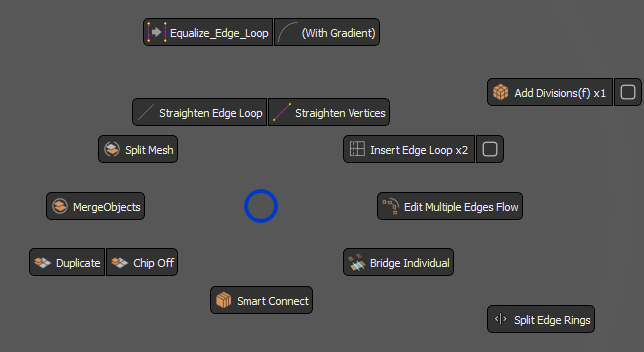

<!-- omit from toc -->
# `Geometry Tools` Pie Menu

  

This Menu is accessible through the Control Panel, with Right Click on the red button at the center. 
Since version `01.01`, it can set to be set to be called through a hotkey, under the name `Central_Pie_Menu_02` in the plugin settings. 
Most of the tools within work with multi mesh selection. 
It contains custom tools, and improved Maya tools that can greatly ease the modeling process:
- [Duplicate, Merge, Extract](#duplicate-merge-extract)
- [Smart Connect](#smart-connect)
- [Bridge Individual](#bridge-individual)
- [InsertEdgeLoop++ \& Add Divisions++](#insertedgeloop--add-divisions)
- [Edit multiple Edge Loops](#edit-multiple-edge-loops)
- [Equalize Edge Loops](#equalize-edge-loops)
- [Straighten Edge Loops, Straighten Vertex](#straighten-edge-loops-straighten-vertex)
- [Split Edge Rings](#split-edge-rings)

## Duplicate, Merge, Extract
  

---
<!-- omit from toc -->
### <b>Duplicate</b>  
Creates a Duplicate of Meshes, or selected components. 
>Note: 
>* Performs duplicate from any type of component selection- face, edge, vertex, uv.
<!-- omit from toc -->
### <b>Chip Off:</b> 
Duplicates selected Meshes, or components, but keeps them inside the mesh.
      
---

<!-- omit from toc -->
### <b>Merge </b> 
Combines Multiple Meshes and parents them to the transform of the last selected Mesh. 
This transform remains intact, and any connections it may have are preserved.

>Note :   
>* <b>Merge</b> function sometimes locks the Mesh normals. Perform `Unlock Normals` in `Mesh Display` menu in Maya to fix this.
                
---

<!-- omit from toc -->
### <b>Extract Selection - Split Mesh</b> 
This is a context button. 
* In <b>Object Mode: </b>Performs  a regular split mesh.
* In <b>Component Mode: </b>it will split the selection into a new Mesh. add a tail "_Pt_01" to its name, and place it below the original mesh. 

---

 
<!--  -->

## Smart Connect
This tool can look intimidating, but is actually very intuitive once one starts using it. 
It is context sensitive, and it does different things for Face, Edge, and Vertex selection:
* Face mode:   
  
In Face Mode, SmartConnect performs connect components, and selects one random half of the original faces.

 

* Edges mode:   
  
In Edge Mode, SmartConnect does different things, in different circumstances:

   * If one Edge is selected, it bridges the two neighboring Edges that lie on the Mesh Border, and selects the newly created one.
   * If two neighboring Edges are selected, It performs polyAppend on the two Edges.
   * If two edges are selected, and they are not neighbors, it performs a simple bridge.
   * If more then two are selected, performs bridge on all of them.
   * If a whole border is selected, it will try to close the border as someone would with the bridge tool in Maya. 
      However, It requires a clean topology around the selection, and can make bad judgment. 
 

* Vertex mode:   
  
As with Edge Mode, does different things depending on the selection:

  If one Vertex is selected, and no other is Highlighted:
  * Performs PolyCloseBorder if that Vertex is on the Border
    
  If two Vertex are selected, or one Vertex and another is Highlighted:
  * If Vertex are neighbors: polyConnectComponents.
  * If they are not neighbors: MultiCut.
  * If both Vertex are on Border: Fill hole, then polyConnectComponents, or MultiCut.

  If more then two Vertex are selected: 
  * If the Verts are on the same face, it will connect every Vertex with the last one.
  * If they are not neighbors, it will connect every Vertex with the Next one in Selection. 

>  Notes :
>  * When connecting two Vertex, and they both lay on a Border and are not neighbors, the tool will always perform PolyCloseBorder before connecting. You may not want that.
>  * When connecting Vertex that are not neighbors, the tool performs MultiCut between them:
>  * Is not accurate, as that is the intrinsic property of the MultiCut Tool. When using the Tool in this fashion, make sure that you are close enough in the viewport and all of the Vertex are visible on the screen. Use it like you would use the MultiCut Tool.  
>  * Currently, this part of the Tool works only on Windows OS.

   

## Bridge Individual
This tool will take the neighboring edges of a selected edge, and bridge those, for each edge in selection separately. After that, it will select the newly formed edges from the bridge.
>  Note :
>  * The `Smart Connect` tool will perform the same action, if one edge is selected

 

## InsertEdgeLoop++ & Add Divisions++
  
Both of these buttons work in similar fashion. Wheel Up or Down will change the number of subdivisions. Click applies the set divisions. 
Add Divisions Button is context sensitive:

* In Edge Mode, it will add subdivisions to the selected Edges.
* In all other modes, it will perform polySubdivideFacet according to the multiplier displayed on the button.

 

    
## Edit multiple Edge Loops
  
This tool edits multiple edge loops, without jumbling the topology. 
Can be performed with button click, but also with mouse wheel up. Wheel down just performs undo on the action, stopping when undo queue reaches some other command.

>Note :
>* Wheel down,  the undo, can sometimes misbehave and not perform the action. Most likely to happen when in Isolate Selection mode.

 

## Equalize Edge Loops
  

This tool makes every edge in a selected edge loop the same length, or alternatively, with a little gradient towards the ends.
 

## Straighten Edge Loops, Straighten Vertex
 

  

This tool straightens selected Edge loops, by finding the end points for each edge and scaling down from there.  
The button to the right straightens vertices. It will straighten everything selected, from to <b>the first to the last</b> vertex in the selection.  
>Note:   
>* Works with transform constrains enabled - Edge and Surface Constraints.

## Split Edge Rings

This tool will perform the `split edge` function from Maya, but for each edge in the selection.  
This operation is computationally heavy, and can take a lot of time to be performed, and even freeze Maya if the selection is substantially bigger then 60. 
Due to this, it will show a warning if the selection has more than 60 edges, although it can perform the operation even with 200+ edges. 

---
 

