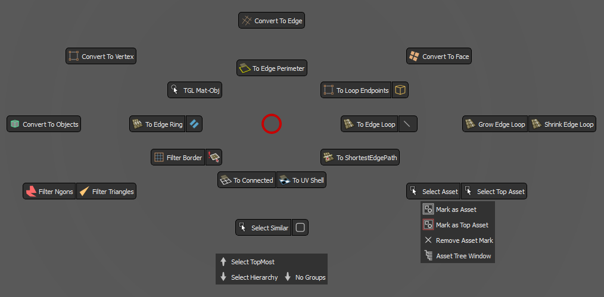

<!-- omit from toc -->
# `Selection Tools` Pie Menu

  

This Menu is accessible through the Control Panel, with Left Click on the red button at the center. 
Since version `01.01`, it can set to be set to be called through a hotkey, under the name `Selection_Pie_Menu` in the plugin settings. 
It contains customized tools that greatly empower the selection process:
- [Convert to #](#convert-to-)
- [Grow/Shrink edge loop](#growshrink-edge-loop)
- [Select Asset/Select Top Asset](#select-assetselect-top-asset)
- [Select TopMost](#select-topmost)
- [Select Hierarchy/No Groups](#select-hierarchyno-groups)
- [Filter Ngons/Filter Triangles/Filter Border](#filter-ngonsfilter-trianglesfilter-border)
- [TGL Mat-Obj](#tgl-mat-obj)
- [To Loop Endpoints/To Cube Edges](#to-loop-endpointsto-cube-edges)
- [To ShortestEdgePath](#to-shortestedgepath)

## Convert to \#
There are four buttons present in the pie menu, for each mesh conversion type. 
These tools will items from one type of selection into another. 
The reason for its creation is because Maya's native conversions are either tricky to perform with the marking menus, or are prone to mistakes in the viewport. 
There are few things to note:
* Converting from object mode will select all of the components of the objects, be it vertices, edges, or faces.
* If a selection is a curve or a lattice, the `Convert To Vertex` tool will go into cv or lattice point selection mode respectively.

 

## Grow/Shrink edge loop
This tool finds the new edges in the edge loop properly, and extends the current selection by one edge on each side. 
There is a grow edge function in Maya which calculates the new edge based on its angle with the source edge. If the angle is too steep, it will not add the edge to the new selection. This tool addresses the issue.

 

## Select Asset/Select Top Asset
The long name  of this tool is `Select Streamflow Selection Asset`. For detailed description, see [here](/Docs/UIs/selection_asset.md). 

In short, you can mark an object to be either an selection asset or a top-selection-asset, which can later be used to quickly select it from any child in the asset's hierarchy.  
This can be useful for quick selecting a model that has logical pieces that need to be constantly tweaked and moved around, like a gun turret, a table with items on it, a character, and so on.
>Note :
>* If you currently have selected an object which doesn't have a `Selection Asset` or `Top Selection Asset` mark, the tool will go up in the hierarchy and select the first parent it finds with the said marks.
>* This tool doesn't work with selection sets, it respects the outliner hierarchy. When you select an `Selection Asset`, it will be as if you have selected the same item in the outliner. 
You can view this tool as if it is working with super-groups - It will treat a `Top Selection Asset` as the topmost parent, and other `Selection Assets` like its children.

 

## Select TopMost
This tool will select the final parent in the outliner of anything that is currently selected.

 

## Select Hierarchy/No Groups
* `Select Hierarchy` will select all of the children of the current selection - transforms and shapes.
* `No Groups` will select only the transforms, but will omit any group it finds.

 

    
## Filter Ngons/Filter Triangles/Filter Border
This tool will deselect anything but ngons, triangles, or border components, depending on the command.
 

## TGL Mat-Obj
This tool will select either the materials of the currently selected meshes, or the meshes that the currently selected materials are attached to.

 

## To Loop Endpoints/To Cube Edges

`To Loop Endpoints` will select the end vertices of the edge loops in the current selection.

`To Cube Edges` works with multiple objects selected, both in object mode, and in vertex mode. 
It will do different things in different circumstances:
* If a three-edged-vertex is selected, it will try to select the edges of the topological cube from there.
* If an object is selected, it will try to find one of the aforementioned vertex by itself, and do the same.
  
 *  >Note :
    >* Will try to find the edges for every object in the selection, even if the objects are merged.
    >* Using this tool in object mode can be signifficantly slower then in vertex mode if the objects are high-poly.
 

## To ShortestEdgePath

This tool will find the shortest edge path between two vertices, or the shortest uv edge path between two uvs.

---
 

