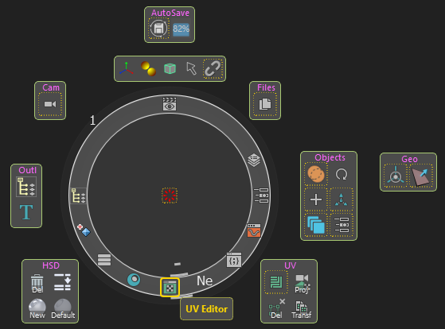

# Control Panel
<br>


<br><br>


Python Command:
```python
streamflow_fn_.GeneralWindowManager.toggle_streamflow_widget()
```

By default, the plugin will map the key "S" to this command. This can be edited in the plugin settings, and the command itself can be set to a native Maya hotkey.

---

<br>

The Control Panel is a floating window that has various plain and interactive buttons, and contains references to all of the pre-build Pie Menus.<br>
By default, a hotkey override will be installed on the key "S", which will call and hide this window. It can be changed to whatever suits the user in [Settings](./settings.md).

To its center is a disk on which various buttons are layed, hereinafter referred to as The Disk. The Disk is composed of two layers, by default accessed by the keys "A" an "D", which can also be changed in the settings menu.<br>
To the center of The Disk, there is a small red button. This button holds the two Pie Menus mapped to right and left mouse click, and two others activated with modifiers+mouse click
The small red button also responds to Wheel Up and Down. This action [Snaps the Camera](../tools/snap_camera.md) to the closest ViewPlane, and toggles the orthographic view. More below.

The disc autofocuses buttons that are placed on it, based on the current mouse position. When focused, every button immediately pops up a tooltip with further description.


The first layer contains most of Maya Editors.<br>
The second layer is currently underdeveloped, but will be utilized in the future.

A click will toggle an editor, while Wheel Up and Down will turn on-off the selected editor.
> * <span style="color: yellow;">Note :</span>
> 
>   * The top most button toggles the Render view, while Right Mouse Click will spawn a Pie Menu that let's you set the desired render engine.\
>      If selected render is Arnold or Redshift, it will call their built-in renderers, for all else, Maya default Render View will be called.<br>
> 
>    * Editors that are shut down this way are not destroyed, just hidden. Most of them require extra second or two, or 15 to turn on when destroyed.<br>
> That is why the plugin will not destroy them, rather hide them.
>      If some editor is turned off in this manner, the default Maya button might not turn it on, because it is just hidden.<br>
>      Maya only checks if an editor exists or not before turning it on. Keep this in mind.

The second layer contains some of the Pie Menus that are scattered in boxes around the Disc. They are just shortcuts of all Pie menus contained in the Boxes around the Disc.
> * <span style="color: yellow;">Note : <br> 
> </span>Clicking a Pie Menu Shortcut button indirectly will work only on Windows OS.

In the plugin `Settings`, a [Circular Shelf](./circular_shelf.md) can be enabled. 
When enabled, the hotkey "Space" will toggle between the Control Panel and the Circular Shelf.
Most of the pie menus can be called with key press from this menu. The keys can also be changed in `Settings`.<br>


## <b>Peculiar Box Menus:</b>

* ### <b> InfoBox: The unnamed box below Autosave:</b>
  This box contains interactive buttons that can be clicked or wheeled, signifying by order :<br>

  1. Transform Constrains 
  2. Soft Selection volumetric or surface falloff
  3. Global Wireframe status
  4. Transform space for Move, Rotate and Scale tools
  5. Selection Constrains
        <br><br>
  * <span style="color: yellow;">Note : </span>
        Selection Constrains button has also a Pie Menu attached to it, and Right Click will turn off any Constrain active.<br>
        There is also a copy of it in the right tab of The Disc, because why not.     
<br>


<br>
<br>


<a href="../../v_01_01_00_README.md#control-panel">
    
</a>