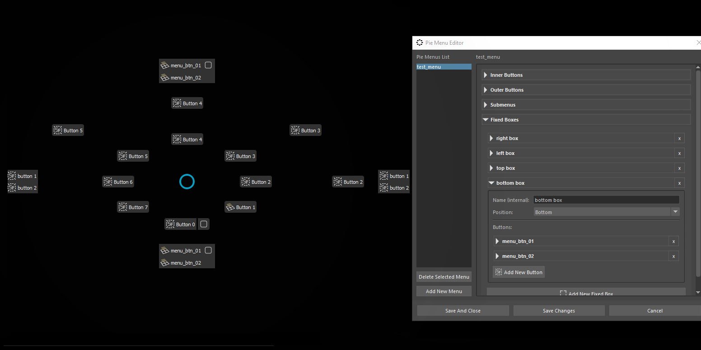
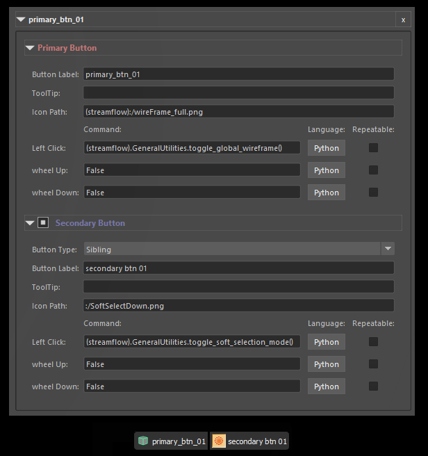

# Pie Menu Editor

 
   
   

This is a tool that lets you create and edit custom pie menus. 
The built-in pie menus can't be viewed or edited here, because they are programmed directly into the plugin.

To the left is a list composed of each individual pie menu, and to the right are the menu settings. 
The setting on the left correspond to the four types of items in the pie menu, and are divided into four sections:
* [Inner and outer buttons](#radial-buttons)
* [Submenus](#submenus)
* [Fixed Boxes](#fixed-boxes)

Each section holds different configurations of the same [menu item]().
 
The editor reads and stores the data as .json files at the following location:

`\Users\<USER>\Documents\maya\<MayaVersion>\prefs\MMGA\Custom_Pie_Menus\`  
Once created, the .json file can be shared with other users.  

Note :
  * Once the menus are adjusted, ths 'Save And Close' and the 'Save Changes' buttons will just save the underlying data to the disk. The plugin should be reloaded with the `'streamflow_fn_()'` command in order for the changes to take effect. 
  * The 'Delete Selected Menu' command will delete the menu data from the disk only when one of aforementioned buttons is clicked.
 
 

## Radial Buttons
 
    

The radial buttons are arranged counterclockwise, starting from the bottom. For each button that is not initiated, there is a placeholder button that can create it. 
The inner or outer shell can be omitted, and this will result in one-layered menu. It is recommended that the outer shell is omitted when this is desired, doing otherwise can cause issues with the appearance and functionality of the menu.

## Submenus
 
    

Submenus pop into existence when the parent button is focused. For now, they are only available on the inner and outer buttons. The shell and the button number onto which the menu should be attached can be set here.  
The `'Transmute Parent'` checkbox signifies if the parent button should be converted to the last button called from its submenu. This will convert the parent button only into the last button clicked, it will not convert the optionbox. 
The buttons inside of the submenu can be moved upwards or downwards. Right click on a button will spawn a context menu with these functionalities.

Note :
  * When setting the shell and button number, make sure that the parent button exists.
  * When setting a submenu to a shell button, avoid setting a checkbox or sibling button to the button. This will make the submenu hard to use.
  * If a submenu is too big, it can overlap with other pie menu items that are near the parent button. Using the button numbers 0,1,2,6,7 and avoiding placing submenus on the inner shell when the outer is also used will help you avoid this issue. 
  The submenus will be upgraded in the next version, so that if the parent button is beyond the middle section of the pie menu (button numbers 4,4,5), it will expand upwards.
 
 

# Fixed Boxes
 
    

The fixed boxes are similar to the submenus, but they are always visible and not bound to any button. 
They can be created as many as is required, and they can be placed top, bottom, left and right, as well as to a custom location. The built-in positions (top, bottom, left, right) will automatically adjust the fixed box to the pie menu, so that they are centered and placed next to the outer shell, or inner if the outer shell is absent. 
The buttons inside of the fixed box can be moved upwards or downwards. Right click on a button will spawn a context menu with these functionalities.

Note :
  * The names of the boxes are there to ease the recognition when editing, but are also used in the pie menu internally. Maintain unique names for each box.
  * The custom coordinates are absolute, so that (0,0) will place the fixed box top left, which may not be visible. The pie menu itself is 2000 pixels wide and tall.
  * There is no safety system installed to discern if two fixed boxes are placed on the same built-in location (top, bottom, left, right). If this error is present, the fixed-boxes can overlap with each other.
 
 

# Menu Item
 
    

Each shell, submenu and fixed box has menu items(buttons) as the final widget. 
They can be set as a single button, a button with option box, or a button with a sibling button next to it. 
* Unchecking the checkbox before the `Secondary Button` label will make the item a single button. 

* By adjusting the `Button Type` field, the button can be set to be an option box or a sibling button.
  
 

## Setting icons:

If the icon belongs to the plugin, the `(streamflow):/` prefix should be added to the icon name, as it is shown in the image. 
If the icon belongs to Maya, only `:/` should be added to the icon. 
An absolute path can be provided in the icon field too, such as `Z:/Projects/Custom_icons/some_icon.png`
 

## Setting Commands:

### External commands:
&nbsp; &nbsp; When setting a command external to the plugin, make sure that the language of the command is set correctly as well.

### Internal Streamflow commands:
Each command executed from the Pie Menus, the custom hotkeys, or from the Control Panel will print out itself in the script editor, if it is not set to silent.

You can either:
1. copy-paste this text into the command field, which wil look something like `"streamflow_fn_.module.Selection.grow_selection_loop()"`
2. substitute `"streamflow_fn_.module"` with `"(streamflow)"`, to that the command will look like: `"(streamflow).Selection.grow_selection_loop()"`, as shown in the example.

 
 

