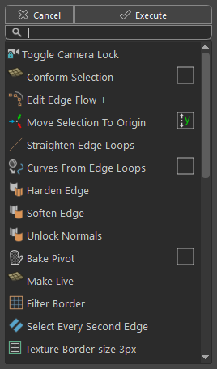

<!-- omit from toc -->
# Quick Menu

<br>


Python Command:
```python
streamflow_fn_.module.PromptBox.show_instance() 
```
It is recommended to assign this tool to a keyboard shortcut, and by default it is assigned to the "Alt+A" key.
    
---


This is a searchbox/quick menu widget that appears where the mouse is. <br>
Since Maya 2023, there is a searchbox shipped with the software, but this is a different tool with different purpose.<br>

It is designed to have smaller, more accessible number of commands, and does not automatically have any native maya command in it. It is very fast and easy to use.It has currently ~30 commands, some custom built, some from Maya.<br>
When hovering over a button, a tooltip will appear that displays an additional info about the command, the category of the command, and the shortcut. 


Key features:
* The window is placed so that the `Execute` button is right under the mouse, for more convenient execution.
* The commands are grouped into categories, and the categories are displayed alphabetically.
* The searching is filtered so that the best match is displayed.
* Every button can have a shortcut - an arbitrary sequence of characters, with which you could quickly find the desired command.
* The last called action will be available the next time the widget is called.


## Adding custom commands

This tool was designed to have a UI dedicated to editing and adding custom commands, but for now, this feature is not yet implemented.<br>
Here is a guide on how to add your own commands to the widget:

When the plugin is run for the first time, it will read the pre-built commands from the source code, and write a .json file named `shortcuts.json` in the following directory:<br>
`\Users\<USER>\Documents\maya\<MayaVersion>\prefs\MMGA\`
you need to open a file with a text editor, scroll to the bottom, and you will see something like this:

```json
    "Camera UV Projection": {
        "category": "uv tools", 
        "strong_tag": "uv", 
        "tags": [
            "uv", 
            "camera", 
            "projection"
        ], 
        "tooltip": "", 
        "command": [
            "UVCameraBasedProjection", 
            "MEL", 
            0
        ], 
        "icon": ":/polyCameraUVs.png"
    
    }
}
```

The text should be inserted before the last "}" bracket, and the bracket before should have a comma after it -the "," character


Here is the text that needs to be inserted:
```json
    "Your Tool Name":{
            "category"      :   "Example Category",
            "tooltip"       :   "",
            "icon"          :   ":/polySoftEdge.png",
            "tags"          :   ["soften edges", "soft", "polygon", "edge", "normal"],
            "strong_tag"    :   "se",
            "command"       :   ["(streamflow).GeomActions.soften_harden_sel(\"soften\")","python",0],
        },
```
The "`category`" field is used to group the tools so they can be displayed next to each other. You can use an existing category, or you can set your own.

The "`tags`" field holds all of the tags which will be used to find a best match when searching in the menu.

The "`strong_tag`" field is the actual shortcut that you can use to quickly find the tool.

The "`command`" field holds three values in a list: the command itself, the command language ("python" or "MEL"), and should the command be added to the repeat stack (0 or 1) .<br>
Same as with the pie editor, to add icons that belong to the plugin you can use the "`(streamflow):/`" prefix, and to add commands native to the plugin the "`(streamflow).`" prefix.


Please note that escape characters should be used when present in the command subfield. To escape all the characters can be very difficult if the command is too long, so using short commands is advised.<br>

If it can't be avoided, there is a workaround:<br>
The hotkeys this plugin provides does the character escaping automatically, so you can add the long script to a hotkey in the plugin's hotkey editor, and later open the hotkey .json file named `HotkeysData.json` located in the same location as the `shortcuts.json` file. If you search for the hotkey there, you can find the formatted command in the appropriate context subfield. 


><span style="color: yellow;">Note : </span> <br>
>* If an error is made in the editing of this file, the whole plugin will not start. Do it carefully, and keep a backup of the `shortcuts.json` file before editing.


<br>

<a href="../../v_01_01_00_README.md#quick-menu">
    
</a>