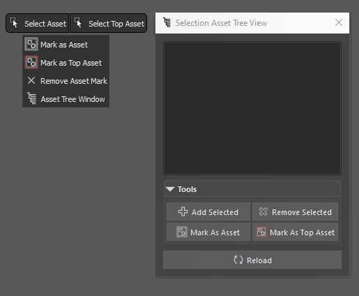

<!-- omit from toc -->
# Selection Asset

<br>
/|\ &nbsp;Left: Part of the `Selection Pie Menu` that contains the commands for this tool.<br> 
&nbsp; &nbsp; &nbsp;
Right: The `Selection Asset` tool UI.

<br>

With this tool, you can mark certain objects as assets, and later quickly select them.<br>
It works by adding an attribute to the transform node, so it will keep this mark at scene save.

You can mark an object to be either an selection asset or a top-selection-asset, which can later be used to quickly select it from any child in the asset's hierarchy. <br>
This can be useful for quick selecting a model that has logical pieces that need to be constantly tweaked and moved around, like a gun turret, a table with items on it, a character, and so on.

## Description

1. Based on the current selection, the `'Select Asset'` command will go up the hierarchy and select an `'Asset'` or a `'Top Asset'` in the parent tree if it finds one. If it finds a `'Top Asset'` mark,  it will not look for any upper assets.<br>
2. The `'Select Top Asset'` command will skip the objects with the `'Asset'` mark, and just look for `'Top Asset'` marks. It will not stop when it finds a `'Top Asset'`, and it will continue to look for the next one.<br>
If the tool doesn't find any asset, it will do nothing.<br>

3. The `'Selection Asset Tree View'` is a UI tool where you can view and select the asset tree. It is similar to the outliner, but will display only the marked objects and omit everything else in the hierarchy.<br>
Pressing the `Reload` button will update the tool with the current selection.<br>
You can have multiple windows of this type opened.


## Access

Python Commands:
```python
streamflow_fn_.module.Selection_Asset() # to call the UI window

streamflow_fn_.module.Selection_Asset.cls_set_as_selection_asset() # to mark as selection asset

streamflow_fn_.module.Selection_Asset.cls_set_as_selection_asset(top_asset=True) # to mark as top selection asset

streamflow_fn_.module.Selection_Asset.cls_remove_attr() # to remove the selection asset mark

streamflow_fn_.module.Selection_Asset.cls_select_selection_asset() # to select asset

streamflow_fn_.module.Selection_Asset.cls_select_top_selection_asset() # to select top asset

```
Can also be found in the `Selection Tools` Pie menu.

---
<br>


<a href="../../v_01_01_00_README.md#selection-asset">
    
</a>