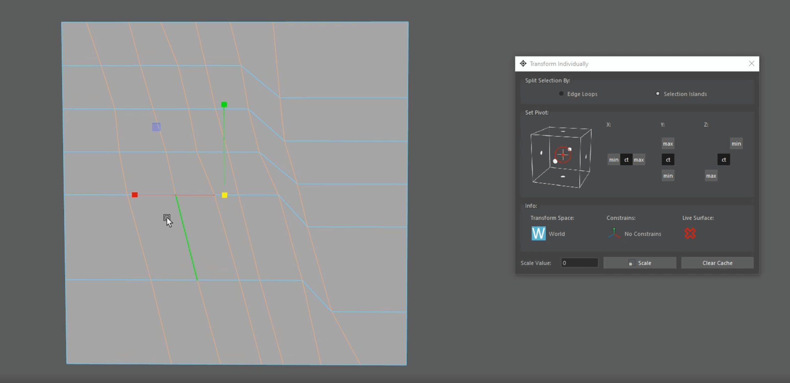
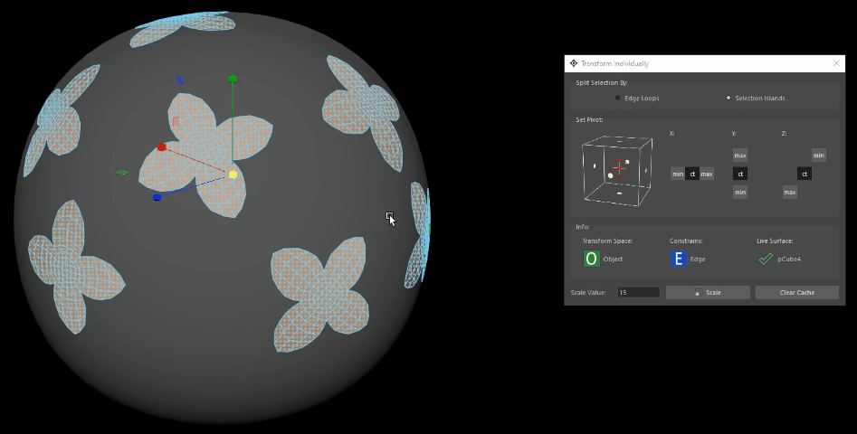

# Transform Parts


<div style="display: flex; flex-direction: row;">


</div>

<br>

This is a very useful tool when there is a need to transform components separately on a mesh that is combined together.<br>
This tool allows you to scale and rotate parts of the selection separately, dividing the selection by edge loops or by selection islands( parts of the selection that are separated by the unselected components).<br>

## Description 
In the first section, there is a choice on how to split the selection, by edge loops or by selection islands.<br>
The second section is used to choose where the pivot for each island will be in world space. <br>

On the left is a bounding box representation where you can click and choose at what of the 27 available positions will the pivot be placed for each selection island. Alternatively, you an set the pivot using the buttons to the right.<br>

The third section is info on the current transform space, transform constrains and live surface.

The heaviest operation in the process is calculating the selection islands or the edge loops. That's why the tool will cache the current selection, and will use the cached version the next time you execute the button. For large meshes this cache can take a noticeable chink of the computer's RAM, around 1Mb per 1000 components selected.<br>
The cache will be cleared when the tool is closed, and the `Clear Cache` button will do the same.

> <span style="color: yellow;">Note :</span>
>  * It can operate on multiple meshes at once.
>  * Soft Selection will not work with this tool, it has completely different internal architecture
>  * Maya transforms vertex components faster than any other type for some reason, even x5 times faster. For fastest execution use this tool with vertex selection.
>  * Even when the selection is small, if the object being edited is high poly, this tool be slow.

<br>
<br>

## Usage
First you need to specify which axis will be the subject of scaling. Then you can choose the settings in the tool according to your needs.<br>
Pressing the "Alt" key on the keyboard while clicking the execute button will allow you to transform with the inverse value of the input: -n for rotate context, 1/n for scale.<br>
The tool is sensitive to the transform space that is currently active (world, object, custom, component), and is sensitive to the current transform constrains. It will also conform to any live surface.

## Access

Python Command:
```python
streamflow_fn_.module.TransformParts()
```
Can also be found in the Control panel, in the `Geo` section.
    

---

<br>


<a href="../../v_01_01_00_README.md#transform-individually">
    
</a>